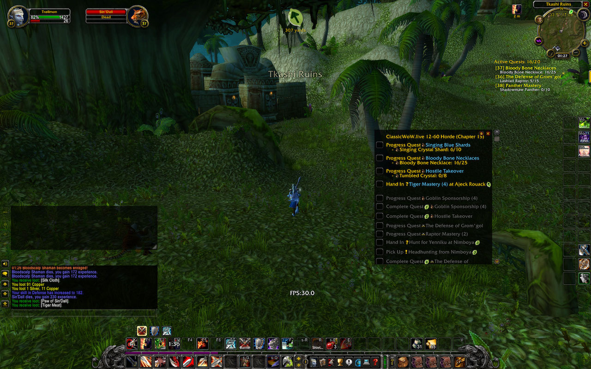

# Guidelime_ClassicWoWdotLive
A tool to generate a set of [Guidelime](https://github.com/max-ri/Guidelime) guides to streamline leveling in WoW Classic.

## Source of the guides
I do not own or represent any rights whatsoever on the guide(s) itself. This tool does not ship any content from [ClassicWOW.live](https://classicwow.live/leveling). It can be used however to download and parse content originating from [ClassicWOW.live](https://classicwow.live/leveling), generating a WoW Classic 1.13 Addon code base.

**Their guides support Horde and Alliance, all starting zones, and 12-60 plus optionally cooking.** While the [website](https://classicwow.live/leveling) allows levling as a party, this projects uses the *solo* leveling guides only.

## Previous work
A similar, earlier project exists in https://github.com/lukeknoot/classicwow-to-guidelime, which I did not know before hacking my version.

## Dependencies
[Guidelime](https://github.com/max-ri/Guidelime)

## Download
This is just a tool, not a ready-made addon. Nothing to download, sorry. Visit: [ClassicWOW.live](https://classicwow.live/leveling)
